# 🧠 CHESS COACH - CONTEXT FOR NEW CHATS

## Quick Summary

**Projekt:** Chess Coach - Personalisierter Schach-Trainer  
**GitHub:** https://github.com/Taze00/chess-coach  
**Status:** In Planung / Phase 1 Starting  

---

## 🎯 Was ist das Projekt?

Ein Web-Tool das:
1. Chess.com Spiele automatisch importiert
2. Mit Stockfish Fehler analysiert und kategorisiert
3. Lichess-Puzzles liefert die DEINE Schwächen trainieren
4. Wie ein Coach alles erklärt (laien-freundlich)
5. Fortschritt sichtbar macht
6. (Später) Als adaptiver Bot gegen dich spielt

**Kern-Problem:** User übt seit Jahren, macht aber dieselben Fehler wieder und wieder. Generische Taktikaufgaben bringen nichts.

**Unsere Lösung:** Personalisiertes Training basierend auf analysierten echten Fehlern.

---

## 👤 User Profil

**Name:** Alex  
**Standort:** Deutschland  
**Skills:** Python, HTML/CSS/JS, SQLite  
**Tools:** VSCode, Claude Code Extension  
**ELO:** ~600-900 (Ziel: Messbare Verbesserung)  
**Platform:** Chess.com  

**Präferenzen:**
- Minimalistisches UI
- Laien-freundliche Erklärungen
- Direkt und praktisch (keine langen Erklärungen)
- Deutsch für UI, Englisch für Code

---

## 🛠️ Tech Stack

```yaml
Backend:
  - Framework: Flask (Python)
  - Database: SQLite → PostgreSQL (später)
  - ORM: SQLAlchemy
  - Auth: Flask-Login + bcrypt

Frontend:
  - UI: Bootstrap 5
  - JS: Vanilla JavaScript
  - Chessboard: ChessboardJS + chess.js
  - Charts: Chart.js

Chess:
  - Analysis: Stockfish Engine
  - Logic: python-chess
  - Puzzles: Lichess Database (3M+)
  - Import: Chess.com Public API

Deployment:
  - Dev: localhost
  - Prod: Railway / Render / Heroku (später)
```

---

## 📂 Projekt-Struktur

```
chess-coach/
├── app.py                 # Main Flask App
├── models.py              # Database Models
├── auth.py                # Authentication
├── chess_api.py           # Chess.com Integration
├── stockfish_analyzer.py  # Stockfish Logic
├── puzzle_matcher.py      # Lichess Puzzle Matching
│
├── templates/
│   ├── base.html
│   ├── index.html         # Landing Page
│   ├── dashboard.html     # Main Dashboard
│   ├── games.html         # Games List
│   ├── training.html      # Puzzle Interface
│   └── progress.html      # Stats & Charts
│
├── static/
│   ├── css/
│   ├── js/
│   └── images/
│
├── requirements.txt
├── .env
├── .gitignore
│
└── docs/
    ├── ROADMAP.md         # Development Plan
    ├── ARCHITECTURE.md    # Tech Details
    ├── TODO.md            # Next Steps
    └── CONTEXT.md         # This File
```

---

## 🗄️ Database Schema

```sql
-- Users
CREATE TABLE users (
    id INTEGER PRIMARY KEY,
    email TEXT UNIQUE NOT NULL,
    password_hash TEXT NOT NULL,
    chesscom_username TEXT NOT NULL,
    created_at TIMESTAMP DEFAULT CURRENT_TIMESTAMP
);

-- Games (importiert von Chess.com)
CREATE TABLE games (
    id INTEGER PRIMARY KEY,
    user_id INTEGER REFERENCES users(id),
    pgn TEXT NOT NULL,
    result TEXT,  -- 'win', 'loss', 'draw'
    played_at TIMESTAMP,
    analyzed BOOLEAN DEFAULT FALSE,
    chesscom_url TEXT,
    created_at TIMESTAMP DEFAULT CURRENT_TIMESTAMP
);

-- Errors (gefunden durch Stockfish)
CREATE TABLE errors (
    id INTEGER PRIMARY KEY,
    game_id INTEGER REFERENCES games(id),
    user_id INTEGER REFERENCES users(id),
    error_type TEXT NOT NULL,  -- 'hanging_piece', 'fork_missed', etc.
    position TEXT NOT NULL,    -- FEN string
    move_played TEXT,
    best_move TEXT,
    explanation TEXT,
    severity INTEGER,          -- 1-10
    created_at TIMESTAMP DEFAULT CURRENT_TIMESTAMP
);

-- Puzzle Progress
CREATE TABLE puzzle_progress (
    id INTEGER PRIMARY KEY,
    user_id INTEGER REFERENCES users(id),
    puzzle_id TEXT NOT NULL,
    error_type TEXT,           -- Welchen Fehler trainiert es?
    attempts INTEGER DEFAULT 0,
    solved BOOLEAN DEFAULT FALSE,
    last_attempt TIMESTAMP,
    created_at TIMESTAMP DEFAULT CURRENT_TIMESTAMP
);

-- Error Stats (für Fortschritts-Tracking)
CREATE TABLE error_stats (
    id INTEGER PRIMARY KEY,
    user_id INTEGER REFERENCES users(id),
    error_type TEXT NOT NULL,
    week TEXT NOT NULL,        -- 'YYYY-WW'
    count INTEGER DEFAULT 0,
    created_at TIMESTAMP DEFAULT CURRENT_TIMESTAMP
);
```

---

## 🚀 Aktueller Status

**Phase:** Planning → Starting Phase 1

**Was existiert:**
- [x] Projekt-Idee definiert
- [x] Features geplant
- [x] Tech Stack ausgewählt
- [x] Roadmap erstellt
- [ ] Projekt Setup
- [ ] User Auth
- [ ] Basic UI

**Was als Nächstes:**
1. Flask Projekt-Struktur erstellen
2. Virtual Environment + Dependencies
3. Database Models definieren
4. User Registration implementieren
5. Login System
6. Basic Dashboard

---

## 📝 Wichtige Entscheidungen

### Feature-Priorität
1. **Core Features zuerst:** Import → Analyse → Training
2. **Bot Feature später:** Erst wenn Core stabil läuft
3. **Monetarisierung optional:** Nur wenn Tool gut funktioniert

### UI/UX Prinzipien
- **Minimalistisch:** Nur essentielle Infos zeigen
- **Laien-freundlich:** Keine Schach-Fachbegriffe ohne Erklärung
- **Motivierend:** Fortschritt sichtbar machen, positive Verstärkung
- **Clean:** Bootstrap 5, moderne Ästhetik

### Technische Entscheidungen
- **SQLite zuerst:** Einfacher für lokale Entwicklung
- **Vanilla JS:** Kein React/Vue needed für MVP
- **Lichess Puzzles:** Kostenlos, 3M+ Puzzles verfügbar
- **Stockfish lokal:** Keine API-Kosten, volle Kontrolle

---

## 🎯 Core Features Details

### 1. Chess.com Import
- **Endpoint:** `/pub/player/{username}/games/archives`
- **Format:** PGN (Portable Game Notation)
- **Speicherung:** Full PGN in DB für spätere Re-Analyse
- **Duplikats-Check:** Via chesscom_url

### 2. Stockfish Analyse
- **Methode:** Jeden Zug evaluieren
- **Threshold:** -2.0 Pawns = Blunder
- **Output:** Position (FEN), Best Move, Explanation

### 3. Fehler-Kategorien
```python
ERROR_TYPES = {
    'hanging_piece': 'Figur ungeschützt gelassen',
    'fork_missed': 'Gabel übersehen',
    'pin_missed': 'Fesselung nicht erkannt',
    'mate_missed': 'Matt übersehen',
    'checkmate': 'Matt verpasst',
    'defensive_mistake': 'Eigene Figur bedroht',
    'endgame_mistake': 'Endspiel-Fehler'
}
```

### 4. Lichess Puzzle Matching
```python
# User hat 60% "hanging_piece" Fehler
# → Filtere Lichess Puzzles mit Theme: "hangingPiece"
# → Rating ±200 vom User's ELO
# → Zeige 10 Puzzles
```

### 5. Coach-Feedback
- **Richtig:** "✅ Genau! In deinem Spiel vs. X hast du das übersehen!"
- **Falsch:** "❌ Schau nochmal: Die Figur auf e5 ist ungeschützt"
- **Hint:** "💡 Tipp: Eine schwarze Figur ist bedroht. Welche?"

---

## 🔄 Workflow

```mermaid
graph LR
    A[User registriert sich] --> B[Chess.com Username]
    B --> C[Spiele importieren]
    C --> D[Stockfish analysiert]
    D --> E[Fehler kategorisiert]
    E --> F[Hauptschwäche: Hanging Pieces 60%]
    F --> G[Lichess Puzzles mit Theme hangingPiece]
    G --> H[User löst Puzzles mit Coach-Feedback]
    H --> I[Fortschritt getrackt]
    I --> J[Neue Spiele → Analyse zeigt Verbesserung]
```



---

## 💡 Besonderheiten

### 1. Spaced Repetition
- Fehlertyp oft falsch? → Häufiger zeigen
- Fehlertyp beherrscht? → Seltener zeigen
- Algorithmus: Leitner System

### 2. Positive Verstärkung
- Nicht nur Fehler zeigen
- Auch Erfolge hervorheben:
  - "7 Spiele ohne Hanging Piece! 🎉"
  - "Deine Gabel-Erkennung ist 40% besser!"

### 3. Verknüpfung zu eigenen Fehlern
- Puzzle: "Das hast DU in Spiel #42 falsch gemacht!"
- Link zum Original-Spiel
- User sieht direkte Relevanz

### 4. Adaptiver Bot (später)
- 70% Normal spielen
- 30% User's Schwächen testen
- Z.B. absichtlich Figur ungeschützt lassen
- Post-Game Analyse wie echtes Spiel

---

## 📚 Resources & Links

### Dokumentation
- **ROADMAP.md** - Vollständiger Entwicklungsplan
- **ARCHITECTURE.md** - Technische Details
- **TODO.md** - Nächste Tasks
- **GitHub:** https://github.com/Taze00/chess-coach

### External Resources
- Flask Docs: https://flask.palletsprojects.com/
- python-chess: https://python-chess.readthedocs.io/
- Stockfish: https://stockfishchess.org/
- Lichess Puzzles: https://database.lichess.org/#puzzles
- Chess.com API: https://www.chess.com/news/view/published-data-api

---

## 🔧 Development Guidelines

### Code Style
- **Python:** PEP 8, snake_case, Docstrings
- **JavaScript:** camelCase, JSDoc comments
- **HTML/CSS:** BEM Methodology optional

### Git Workflow
```bash
# Feature Branch
git checkout -b feature/chess-import
git add .
git commit -m "feat: Add Chess.com game import"
git push origin feature/chess-import
# Pull Request → Review → Merge
```

### Commit Messages
- `feat:` Neue Features
- `fix:` Bug Fixes
- `docs:` Dokumentation
- `refactor:` Code Refactoring
- `test:` Tests

---

## 🚨 Wichtige Hinweise für neue Chats

### Wenn du in einem neuen Chat weitermachen willst:

**Sag zu Claude:**
```
Hi! Ich arbeite am Chess Coach Projekt.

GitHub: https://github.com/Taze00/chess-coach
Branch: main

Bitte lies:
- /chess-coach-docs/ROADMAP.md
- /chess-coach-docs/TODO.md
- /chess-coach-docs/CONTEXT.md

Wir sind bei Phase [X] und machen gerade [Y].
Kannst du weitermachen wo wir aufgehört haben?
```

### Claude Code Extension
- **Kann NICHT mit diesem Chat kommunizieren**
- **Aber:** Kann dieselben Dateien in VSCode sehen
- **Lösung:** GitHub + Dokumentation für Kontinuität

### Projekt-Instruktionen
Im Claude Project "Chess Coach" kannst du Custom Instructions setzen:
```
PROJEKT: Chess Coach
REPO: https://github.com/Taze00/chess-coach
STATUS: Check ROADMAP.md und TODO.md
USER: Python/Web-Dev, bevorzugt praktische Lösungen
```

---

## 📊 Success Metrics

**Wir messen Erfolg an:**
- ✅ Fehlerreduktion von -20% nach 4 Wochen
- ✅ Puzzle Completion Rate >60%
- ✅ User Retention >40% nach 7 Tagen
- ✅ Page Load Time <2s
- ✅ User Feedback >4.0/5.0 Stars

---

## 🎓 Lessons Learned

*Wird während der Entwicklung gefüllt*

### Was gut funktioniert:
- TBD

### Was nicht gut funktioniert:
- TBD

### Was wir beim nächsten Mal anders machen:
- TBD

---

**Version:** 1.0  
**Letzte Aktualisierung:** November 2024  
**Nächstes Update:** Nach Phase 1 Completion
